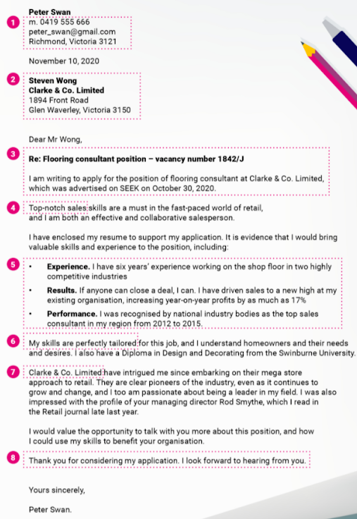
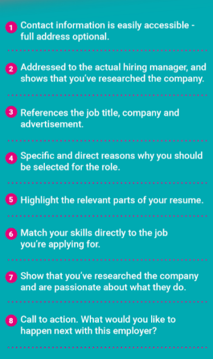
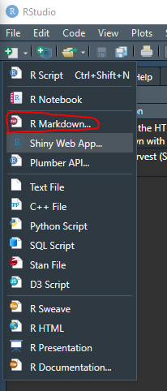
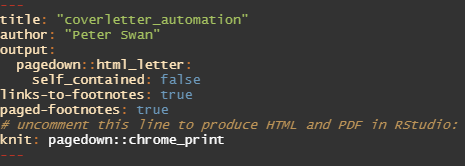
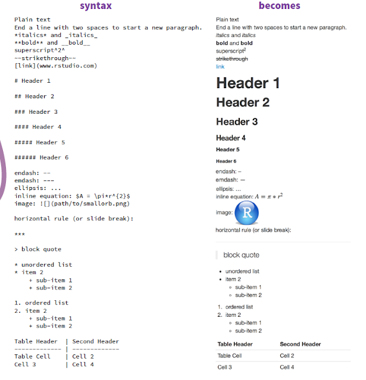
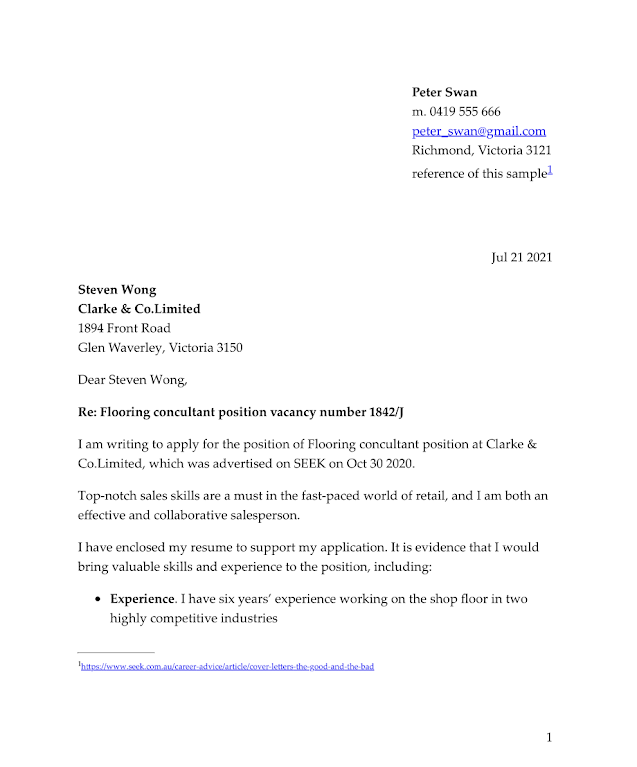
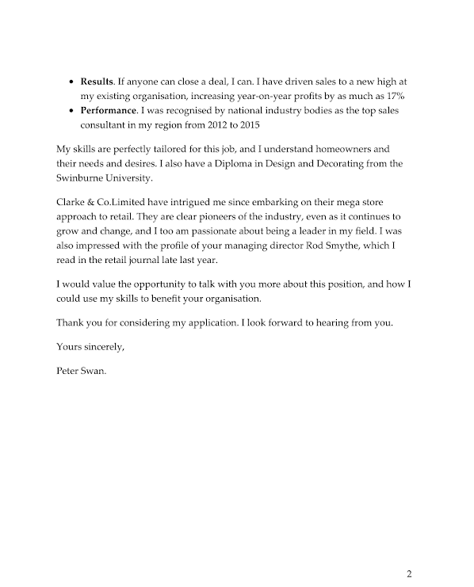

```{r setup, include=FALSE}
knitr::opts_chunk$set(echo = TRUE, eval = FALSE)
```

**In this introduction, I will explain how to partially automate your cover letter by R. **

I do this cover letter automation to help me create some data-driven cover letters. These cover letters are not perfectly polished, but they are the perfect start to assist you in dealing with hundreds of job applications.

Here are 2 references that helped me to create this tutorial:

- https://www.seek.com.au/career-advice/article/cover-letters-the-good-and-the-bad

- https://pagedown.rbind.io/

*Update 27/08/2021: The approach I used for over 30 cover letters was more complicated than this introduction. 30% of these cover letters helped me pass the first stage of job applications.

Many thanks to Yihui Xie who contributed so many wonderful R packages, and I am so glad to connect with him on Linkedin. 


# Step 1 
## Read the sample cover letter and image yours.

Let us firstly read this sample:





Seek has given the excellent structure hints under the letter. I disassemble this sample letter into 14 variables, they are:

- 1 HR name

- 2 Company name

- 3 Address

- 4 City and postcode 

- 5 Job title 

- 6 Job reference number

- 7 Advertisement from

- 8 Job post date

- 9 Skill requirement

- 10 Skills match

- 11 Company background

- 12 Your experience

- 13 Results

- 14 Performance

I made two spreadsheets to store these 14 variables, you can find them in the following links:

[seek_example.xlsx](https://docs.google.com/spreadsheets/d/1iJDwY-_3hwkgS359EWRff-e7qqSCOGiy/edit#gid=362556491)

[experience_list.xlsx](https://docs.google.com/spreadsheets/d/1DINnaeeiw-B6qYcff3QetS-kZag9MfRL/edit#gid=1760578184)


# Step 2
## Prepare R and packages

Package:
- 1 dplyr
- 2 pagedown

Once you installed these two packages in RStudio, you can create an R Markdown file



And select "from template", then HTML Letter.


Your RStudio will open a sample letter. Keep the first 11 lines and change your title, author and Knit setting. Like this:



You can remove the rest content and you are ready.

# Step 3
## 3.1 Import Excel files 

Firstly, you can load the package dplyr and set up chunk knit options.

```{r eval=FALSE,echo=TRUE}
library(dplyr)
knitr::opts_chunk$set(echo = FALSE, warning = FALSE, message = FALSE, include = FALSE)
```

Secondly, you can import two Excel files:

```{r import}
path <- "D:/My Storage/blog/Cover letter/"
company_detail <- readxl::read_xlsx(paste0(path,"seek_example.xlsx"))
exp_list <- readxl::read_xlsx(paste0(path,"experience_list.xlsx"))
```

* The path is your folder address where you store two spreadsheets.

## 3.2 prepare 14 variables

**Since the spreadsheets are imported, you can manage 14 variables. I leave all codes below. Comments stay after # to introduce some hints.**

```{r company row}
# Indicate which company (# row) you write for in the 'company_detail'
rownumber <- 1
```

```{r company details}
# in case if there is no specific manager name, you can use "Hiring Manager".
manager_name <- company_detail[rownumber,][,"HR_name"] %>% unlist() %>% ifelse(is.na(.) == "TRUE","Hiring Manager", .)
# If you forget to write company name, it will warn you "No company name?"
company_name <- company_detail[rownumber,][,"company_name"] %>% unlist() %>% ifelse(is.na(.) == "TRUE","No company name?", .)
# In case there is no address, you can leave blank.
company_address <- company_detail[rownumber,][,"address"] %>% unlist() %>% ifelse(is.na(.) == "TRUE","", .)
# In case there is no address, you can leave blank.
city_postcode <- company_detail[rownumber,][,"city_postcode"] %>% unlist() %>% ifelse(is.na(.) == "TRUE","", .)
```

```{r job detail}
# your job title. It warns you if there is no job title.
job_title <- company_detail[rownumber,][,"job_title"] %>% unlist() %>% ifelse(is.na(.) == "TRUE","**Wrong title !**", .)
# the job reference number. It will leave blank if there is no reference number
job_number <- company_detail[rownumber,][,"job_number"] %>% unlist() %>% ifelse(is.na(.) == "TRUE","", .)
# where you find this job information. It leaves blank if there is no information.
adv_from <- company_detail[rownumber,][,"adv_from"] %>% unlist() %>% ifelse(is.na(.) == "TRUE","", .)
# The post date of this job. I make this date format as "OCT 30 2020", and you are free to change it. 
post_date <- company_detail[rownumber,][,"post_date"] %>% pull(.) %>% as.Date(.) %>% format(., "%b %d %Y") %>% ifelse(is.na(.) =="TRUE","", . )
# logic check. Add 'on' before date if there is a valid date. 
on_logi <- ifelse(is.na(post_date) == FALSE, "on ", "")
```

```{r experience results and performance}
# your experience
experience <- exp_list[rownumber,][,"Experience"] %>% unlist() %>% ifelse(is.na(.) == "TRUE", "",.)
# results
results <- exp_list[rownumber,][,"Results"] %>% unlist() %>% ifelse(is.na(.) == "TRUE", "",.)
# performance
performance <- exp_list[rownumber,][,"Performance"] %>% unlist() %>% ifelse(is.na(.) == "TRUE", "",.)
```

```{r skill match and company background}
# what skills match the job
skills <- company_detail[rownumber,][,"skills_required"] %>% unlist()
# more detail
skill_match <- company_detail[rownumber,][,"Skills_match"] %>% unlist()
# company background and research
company_background <- company_detail[rownumber,][,"company_research"] %>% unlist()
```


# Step 4
## Create the cover letter structure 

Here I display some fundamental Rmarkdown syntax rules to format text in the final report: 



You can also find the cheatsheet at this link: 

- https://www.rstudio.com/wp-content/uploads/2015/02/rmarkdown-cheatsheet.pdf

**The sample cover letter structure is below:**

```{r}
::: from
**Peter Swan**     
m. 0419 555 666   
peter_swan@gmail.com  
Richmond, Victoria 3121
[reference of this sample](https://www.seek.com.au/career-advice/article/cover-letters-the-good-and-the-bad)
:::

::: date
`r paste(date)`
:::

**`r paste(manager_name)`**  
**`r paste(company_name)`**  
`r paste(company_address)`  
`r paste(city_postcode)`  

Dear `r paste(manager_name)`,  

**Re: `r paste(job_title," ",job_number)`**  

I am writing to apply for the position of `r paste(job_title)` at `r paste(company_name)`, which was advertised on `r paste(adv_from)` `r paste(on_logi,post_date)`.  

`r paste(skills)` skills are a must in the fast-paced world of retail, and I am both an effective and collaborative salesperson.  

I have enclosed my resume to support my application. It is evidence that I would bring valuable skills and experience to the position, including:  

- **Experience**. `r paste(experience)`  
- **Results**. `r paste(results)`  
- **Performance**. `r paste(performance)`  

My skills are perfectly tailored for this job, and `r paste(skill_match)`

`r paste(company_name)` `r paste(company_background)`

I would value the opportunity to talk with you more about this position, and how I could use my skills to benefit your organisation.  

Thank you for considering my application. I look forward to hearing from you.  

Yours sincerely,  

Peter Swan.

```

* I use the following codes to get current date and time:

```{r date}
date <- Sys.Date() %>% format(., "%b %d %Y")
```

* A great feature of using R pagedown to write a cover letter is that you can always add hyperlinks to it. This allows HR to directly open your LinkedIn page and other information.  

* As an example, I add a hyperlink of the SEEK sample letter into this cover letter, you can find it under the home address.

Here is the output:




This basic cover letter automation is done!
