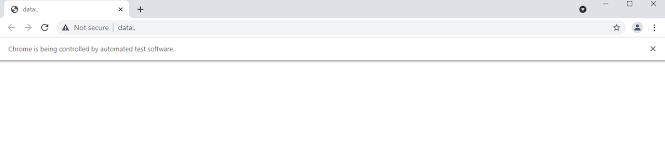
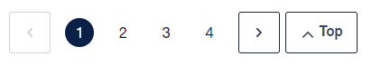
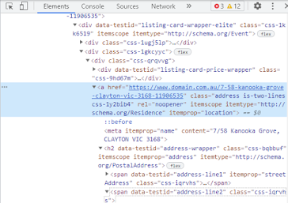
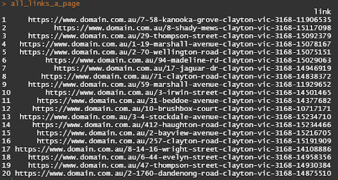
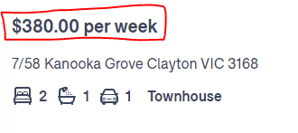
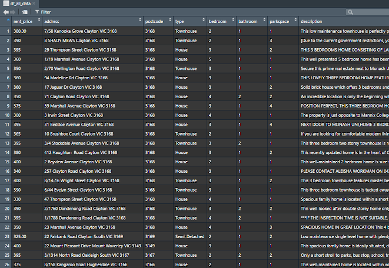

```{r setup, include=FALSE}
knitr::opts_chunk$set(echo = TRUE, eval = FALSE)
```

# Real Estate data (rental property)

In this introduction, I will explain how to use Rselenium and rvest to collect real estate data. 

You don't need to be a data scientist to understand this tutorial. The only thing you need is fundamental R programming knowledge and a little web element experience in Chrome.

Most real estate webs do not provide sufficient options to filter keywords precisely, but you can detect keywords from strings once you collect data in R. 

Here are two references that helped me to understand web scraping:

- https://thatdatatho.com/tutorial-web-scraping-rselenium/
- https://github.com/yusuzech/r-web-scraping-cheat-sheet/blob/master/README.md.
- https://cran.r-project.org/web/packages/RSelenium/vignettes/basics.html

# Step 1
## Load packages
The first thing to do is to load packages
```{r}
library(tidyverse)
library(RSelenium) # scrape dynamic sites
library(rvest) # scrape static sites
library(xml2) # parse page elements
library(httr) # parse page elements
library(data.table)
```

To use Selenium, you need to open a **remote driver** first. The most common issue that happens here is **the wrong chrome version**. Sometimes your updated Chrome version does not match the latest chrome version that the selenium driver supported. One reason is that the latest chrome of Selenium driver matches the Chrome beta version rather than normal Chrome. You can always set up an earlier version in `rsDriver()`  to solve this problem, but here I provide a smarter option. 


# Step 2
## Select chrome version and connect selenium driver

```{r}
# Check the available chrome version, the default is latest
verlist <- binman::list_versions("chromedriver") %>% flatten_chr()

# check my chrome version. wmic: WMI command-line. The file path may vary
version <- system2(command = "wmic",args = 'datafile where name="C:\\\\Program Files (x86)\\\\Google\\\\Chrome\\\\Application\\\\chrome.exe" get Version /value',stdout = TRUE,stderr = TRUE)
version <- str_sub(version[3],start = 9,end = -2)

# select the latest version earlier than the current chrome version 
ver <- max(verlist[version > verlist])

# driver setting | "redr" is for remote driver
driver <- rsDriver(browser = "chrome", chromever = ver)
driver$client$close()
redr <- driver[["client"]]
redr$open() # open remote driver
# redr$close() # close remote driver 
```

if you success, you will open a blank Chrome page like this:


# Step 3
## Disconnect remote driver (you don't need to do it now)

Although `redr$close()` can close the Chrome, it does not disconnect the driver and you can not establish the driver again if you do not disconnect. You can not do it in R but you can command R to kill the task in system.

- https://github.com/ropensci/RSelenium/issues/228

```{r}
# to cleanup the port, by kill the java instance(s) inside Rstudio
# refer: https://github.com/ropensci/RSelenium/issues/228
system("taskkill /im java.exe /f", intern=FALSE, ignore.stdout=FALSE)
# check if ports still open
pingr::ping_port("localhost", 4567)
```

# Step 4
## We first open the URL

```{r}
main_site <- "https://www.domain.com.au" # Domain main page

# rent price between $300 to $400 per week in Clayton
clayton_300_400 <- "https://www.domain.com.au/rent/clayton-vic-3168/?ptype=duplex,free-standing,new-home-designs,new-house-land,semi-detached,terrace,town-house,villa&bedrooms=2-any&price=300-400&excludedeposittaken=1&carspaces=1-any&ssubs=0&page=1"

url <- clayton_300_400 # give value to url

redr$navigate(url) # navigate to the page
```


You can also find the number of total pages here. I will explain why do you need this later.



# Step 5
## Store URLs for property lists

Our next target is to identify page structure and store all URLs.

You can find the **"page=1"** in the tail of the URL, this indicates the first web page for a total of 80 properties. 
Each web page contains 20 properties so that you have a total of 4 web pages. 

To store 4 URLs, you can use function `paste0()`. 


```{r selenium}
urls <- sapply(1:4, function(x){
  url <- "https://www.domain.com.au/rent/clayton-vic-3168/?ptype=duplex,free-standing,new-home-designs,new-house-land,semi-detached,terrace,town-house,villa&bedrooms=2-any&price=300-400&excludedeposittaken=1&carspaces=1-any&page="
  urls <- paste0(url,x)
})
```


# Step 6
## Inspect web elements

We find there are 20 properties on each page. In order to collect all information on each property, you need to open each property page. Before that, you have to find and collect 20 URLs of properties in each page. 

Right-click in Chrome you can open a menu and click "inspect". Or you can simply use Ctrl+Shift+I.


Move cursor to the address of one property and right-click to choose "inspect". The element window will automatically highlight the selected web elements.




Find keywords **"href="**. This is the URL for this property. You can also find the **"class="** which is another key element that you will use in the next step. 

# Step 7

## Extract 80 URLs for all properties.

### 7-1 Using Rselenium (for dynamic site)

To properly understand this part, you need to identify what is **"class="** and **"href="** in the web elements.

**The easier way to understand these is that you assume the "class=" is the lock of the chest (web elements), and "href=" is the reward in the chest.**

Since you can not physically touch the chest, you use R to mimic our behaviour. 

First, you use `redr$findElements` to unlock the chest.

```{r}
# I apply xpath in this example
each_prop_links <- redr$findElements(using = "xpath", value = "//*[@class='address is-two-lines css-1y2bib4']")
```

Where the **"xpath"** is the tool you use to unlock, and value = "//*[@class='address is-two-lines css-1y2bib4']" is the hacking codes. 

You can find "class='address is-two-lines css-1y2bib4'" from web elements as following:


variable "each_prop_links" helps to store all information related to the specific class. However, you only need the information store in the `"href="`. 

**Now, find 20 property address.**

you can use `each_prop_links$getElementAttribute("href")` by loop to extract 20 urls for all property in the first list. 

```{r}
all_links_a_page <- sapply(each_prop_links,function(x){x$getElementAttribute("href")}) 
all_links_a_page <- data.frame(link = unlist(all_links_a_page))
```



**Now, find 80 properties**

```{r}
# 80 properties links:

links_all <- data.frame()
for(i in 1:(length(urls))){
  redr$navigate(paste0(urls[[i]]))
  Sys.sleep(3)
  links <- redr$findElements(using = "xpath", value = "//*[@class='address is-two-lines css-1y2bib4']")
  df <- sapply(links,function(x){x$getElementAttribute("href")})
  df <- data.frame(link = unlist(df))
  Sys.sleep(1)
  links_all = rbind(links_all, df)
}
```

Depends on your computer's performance and the internet speed, `Sys.sleep()` can vary. 

You can use `uniqueN()` to check duplication. Make sure the output is 80 links.

You should only consider Selenium when rvest is unavailable. Rselenium is usually time-consuming. 

### 7-2 Using rvest (for static web)

In rvest package, `read_html()` is the most popular function to parse web elements. Rvest does not require you to open a remote driver, but you still need to understand the web elements. 

However, if you try `read_html(url)` in this tutorial example, R will run this code for a very, very long time, at least I waited five minutes and it was still running. 

The reason for long waiting can be complicated and I am lack of relevant knowledge to figure out. Fortunately, plan B is available.

**The alternative way to parse elements is to use the "httr" package.**

```{r}
# GET() and content() do similar work as read_html(). 
response <- GET(urls[1])
page <- content(response , as = "parsed")
```

**Return to rvest package**

```{r}
# Extract elements from "page" and record addresses from "href="
page_links <- page %>% html_nodes(".address.is-two-lines.css-1y2bib4") %>% html_attr("href")
```

* We can use `html_elements()` to replace `html_nodes()`
* This is exactly the function of `"class="` and `"href="` in Rselenium package

**To store all 80 addresses, you can use a similar method as you applied in the Rselenium part.**

```{r}
store_links <- data.frame()
pagelinks <- function(urls){
  response <- GET(urls)
  page <- content(response, as = "parsed")
  one_page_links <- page %>% html_nodes(".address.is-two-lines.css-1y2bib4") %>% 
    html_attr("href") %>% data.frame(links = .)
  store_links <<- rbind(store_links, one_page_links)
}

```

# Step 8
## Collect property details from each link

When you open the link for a property, you can find details such as price, address, number of bedrooms, bathrooms, car park, and description. These are the details you will scrape. 

Scraping these details is just like what you did for "class=" and "href=". Besides, you only need to consider "class=" in this part. 

### 8-1 scraping rent price

Inspect the web elements of rent price by right-clicking it and chose to inspect. 



We will find the high lighted elements as follow:


```{r}
# price example

price <- page %>% html_nodes(".css-1texeil") %>% 

  html_text() %>% 

  str_extract(.,"\\-*\\d+\\.*\\d*") # only keep the digits, here is 380.00
```

### 8-2 repeat process to all details

```{r}
# address

page %>% html_nodes(".css-164r41r") %>% 

  html_text()

# postcode

page %>% html_nodes(".css-164r41r") %>% 

  html_text() %>% 

  word(.,-1)

# house / townhouse

page %>% html_nodes(".css-in3yi3") %>% 

  html_text() %>% 

  .[[2]] 

# number of bedroom/ bathroom/ car park

bed <- page %>% html_nodes(".css-lvv8is") %>% 

  html_text() %>% 

  .[[1]] %>% word(.,1,1)


bath <- page %>% html_nodes(".css-lvv8is") %>% 

  html_text() %>% 

  .[[2]] %>% word(.,1)


park <- page %>% html_nodes(".css-lvv8is") %>% 

  html_text() %>% 

  .[[3]] %>% word(.,1)


# description

decp <- page %>% html_nodes(".css-bq4jj8 p") %>% 

  html_text() %>% 

  paste(collapse = " ") 
```


### 8-3 simple filters

You can also filter keywords such as " heat" and " condition" by str_detect()

```{r}
# test if there is heating information

decp %>% 

  str_detect(" heat")

# 1 = mentioned heat/heating/heat...... in description, 0 = null

ifelse(str_detect(decp," heat"),1,0)

# 1 = mentioned condition/conditioning/condition.... in description, 0 = null

ifelse(str_detect(decp," condition"),1,0)
```

* beware that I leave a whitespace before "heat" and "condition" to avoid certain situation such as "greatcondition".


### 8-4 Put all parts together

```{r}
df_all_data <- data.frame()


scraper <- function(links){

  # single url 

  url <- links

  # PARSE PAGE URL

  response <- GET(url)

  page <- content(response, as = "parsed")

  Sys.sleep(0.5)

  # rent price

  rent_price <- 

    page %>% html_nodes(".css-1texeil") %>% 

    html_text() %>% 

    str_extract(.,"\\-*\\d+\\.*\\d*")

  # address

  address <- 

    page %>% html_nodes(".css-164r41r") %>% 

    html_text()

  #postcode

  postcode <- 

    address %>% word(.,-1)

  # property type

  type <- page %>% html_nodes(".css-in3yi3") %>% 

    html_text() %>% 

    .[[2]]

  # bedroom

  bedroom <- page %>% html_nodes(".css-lvv8is") %>% 

    html_text() %>% 

    .[[1]] %>% word(.,1,1)

  #bathroom

  bathroom <- page %>% html_nodes(".css-lvv8is") %>% 

    html_text() %>% 

    .[[2]] %>% word(.,1)

  # park

  parkspace <- page %>% html_nodes(".css-lvv8is") %>% 

    html_text() %>% 

    .[[3]] %>% word(.,1)

  # description

  description <- 

    page %>% html_nodes(".css-bq4jj8 p") %>% 

    html_text() %>% 

    paste(collapse = " ")

  # heat related information 

  heat <- ifelse(str_detect(description," heat"),1,0)

  # air condition information

  ac <- ifelse(str_detect(description," air "),1,0)

  # store single property information

  df_one_page <- data.frame(rent_price = rent_price,

                            address = address,

                            postcode = postcode,

                            type = type,

                            bedroom = bedroom,

                            bathroom = bathroom,

                            parkspace = parkspace,

                            description = description,

                            heat = heat,

                            ac = ac)

  df_all_data <<- rbind(df_all_data, df_one_page)

}


sapply(links, scraper)
```




Great! The web scraping is just done! You can clean the data, add filters or output CSV. 
