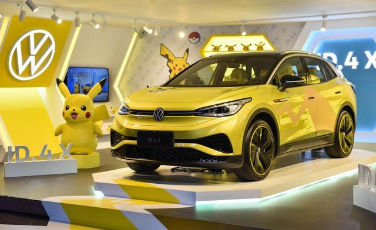

```{r setup, include=FALSE}
knitr::opts_chunk$set(echo = TRUE)
```

**A new project Eve (Electric Vehicle and fuel combustion Vehicle Evaluation) here!**

Recently, my partner is planning to buy her first car. As a former motor mechanic and a fan of  data analysis, I decided to provide the best advice to her :) 

On the other hand, I am considering buying my first pure electric car since my father bought a Volkswagen ID.4X Pikachu version three weeks ago.  Sometimes I think my father has a more innovative mindset to embrace the latest technology than me. LOL



**ID.4** is an excellent pure electric car at an affordable price in China. However, I guess Volkswagen won't bring it to the Australian market this year. I think the main reason is that China has comprehensive manufacturing chains to produce almost every piece of component and assemble them. 

The first step is to collect the data from the internet, which I have done 65% including over 40000 car data in Australia. I will study these data and try to create a model to evaluate the car price assisting my partner's decision making. 
I also shared my scraping coding work on [Github](https://github.com/wwfeitim/Eve), and feel free to read and use it.

Some sample data:
```{r echo=FALSE}
library(readr)
library(data.table)
df <- fread("D:/Projects/EVE/Eve/data_collect_raw_08_29_2021.csv")
head(df)
```


The second part is to build a calculator by `Shiny` and embed it into my blog. This calculator can predict the money saved by the switch from fuel combustion vehicle to pure electric car in long-term period. Learning `Shiny` is a critical task in this project. By presenting the model through `Siny` app, everyone can use the tool without knowing how to program it.

Hoping I can complete this project by October.